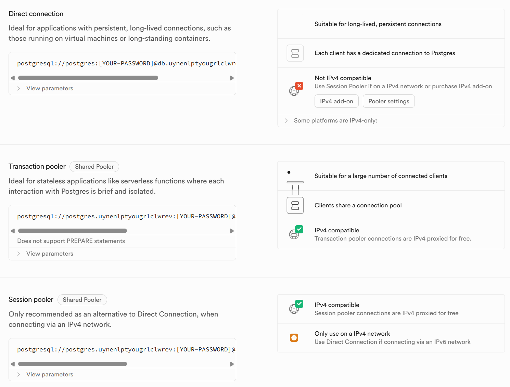
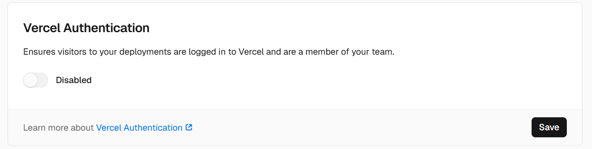

# Step 1: using external database instead of sqlite

### Problem and Solution

- Problem: I spent one hour integrating MySQL, but my project still used SQLite as database
- Reason & Solution: I forgot adding some variables in the `.env` file and installing some necessary dependencies. 
 

- Problem: AI told me that planetscale is a good way to put my database on cloud. However, this platform is no more free now. TT
- Reason & Solution: You can choose to pay for it, but I choose to use Postgre and supabase instead.  
 

- Problem: my pc cannot reach host of supabase
- Reason & Solution: It's beceause when I copied the connection string, I found there were multiple strings and I mistakenly chose a string that only support ipv6, and my pc/network don't have ipv6 route. There is another string connection string supporting ipv4! Don't be careless like me. 

### Summary/what I learnt in step 1
- since my pc won't be always on, an external database on cloud is necessary. It's a primary truth and I should have known it, but I forgot it at the beginning. as a result, I did some useless work.
- in my previous projects, I always use my own pc as server and database because I think operation on cloud would be very complex and costly, and I never try it before. But after these days' attempt, I found it really convenient!

# Step 2: deploy my app on vercel

### Problem and Solution

- Problem: When other people try to visit my app, they have to login in vercel and apply for join my team.
- Reason & Solution: I forgot changing the configuration about authentication. Go into Dashboard/Setting/Depolyment Protection and there is a "Vercel Authentication". Click it to "Disabled".

### Summary/what I learnt in step 2
- I learnt how to deploy app on vercel
- to my surprise, I didn't change my python code in this step. everything seems to have been done in step 1 when writing logic of determining which database(sqlite, mysql or supabase) will be selected

# Step2.1: add ai into app
> I forget adding ai into my app, now I'm going to make it up

- Problem: functions about AI didn't work and error code is 405 Method Not Found
- Reason & Solution: It's because API routes in frontend and backend are different. AI make this stupid mistake and I didn't check it.
 

- Problem: I try to translate note's content but some sentences will cause 500 Internal Server Error
- Reason & Solution: It's because these sentences are sensitive so LLM refused to translate. I can do nothing with it but add an error msg to tell users what's going on. However, I don't think my content is sensitive though 

# Step2.2: restore supabase and redeployment

- Problem: My database in supabase was paused and deployment was expired
- Reason&Solution: It's because I haven't visit my app for more than half a month. Now I have to restore my database and redeploy my project. Besides, I submitted temp url in forms and this url would change after redeployment. Vercel provides a persistent url but I didn't find it before. Don't be careless like me. TT
